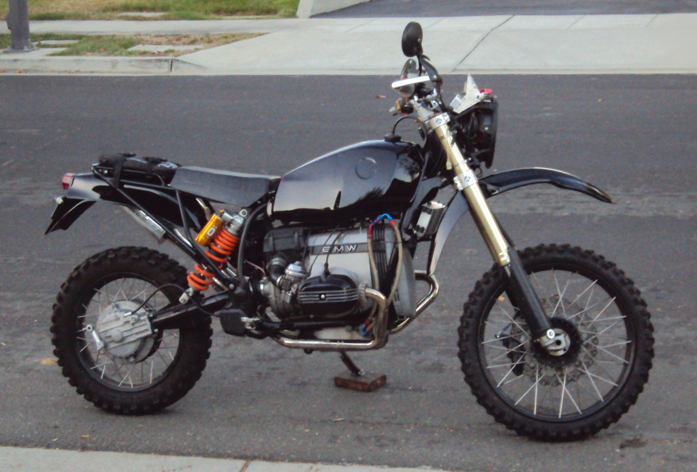

# ORGS Build Up

Build up of the ORGS BMW R100GS motorcycle.

## Content

* [ORGS Build Up - Page 01](https://github.com/glevand/orgs-build-up/blob/master/orgs-build-up-01.adoc)
* [ORGS Build Up - Page 02](https://github.com/glevand/orgs-build-up/blob/master/orgs-build-up-02.adoc)
* [ORGS Build Up - Page 03](https://github.com/glevand/orgs-build-up/blob/master/orgs-build-up-03.adoc)
* [ORGS Build Up - Page 04](https://github.com/glevand/orgs-build-up/blob/master/orgs-build-up-04.adoc)
* [ORGS Build Up - Page 05](https://github.com/glevand/orgs-build-up/blob/master/orgs-build-up-05.adoc)
* [ORGS Build Up - Page 06](https://github.com/glevand/orgs-build-up/blob/master/orgs-build-up-06.adoc)
* [ORGS Build Up - Page 07](https://github.com/glevand/orgs-build-up/blob/master/orgs-build-up-07.adoc)
* [ORGS Build Up - Page 08](https://github.com/glevand/orgs-build-up/blob/master/orgs-build-up-08.adoc)
* [ORGS Build Up - Page 09](https://github.com/glevand/orgs-build-up/blob/master/orgs-build-up-09.adoc)
* [ORGS Build Up - Page 10](https://github.com/glevand/orgs-build-up/blob/master/orgs-build-up-10.adoc)
* [ORGS Build Up - Page 11](https://github.com/glevand/orgs-build-up/blob/master/orgs-build-up-11.adoc)
* [ORGS Build Up - Page 12](https://github.com/glevand/orgs-build-up/blob/master/orgs-build-up-12.adoc)
* [ORGS Build Up - Page 13](https://github.com/glevand/orgs-build-up/blob/master/orgs-build-up-13.adoc)

## Licence & Usage

All files in the [ORGS Build Up Project](https://github.com/glevand/orgs-build-up), unless
otherwise noted, are covered by the
[Fabricators Design License](https://github.com/glevand/orgs-build-up/blob/master/fabricators-design-license.txt).
The text of the license describes what usage is allowed.
